SERVICE 24/7 ACCESS TO CARE


## 2.1 Tổng quan Service


**Mô tả:** Dịch vụ tư vấn y tế từ xa 24/7 cho các vấn đề cấp tính (Acute Care), tương tác qua **giao diện trò chuyện AI (AI Chatbot)** trên App/Web

### 📱 Phương thức giao tiếp

Khách hàng có thể lựa chọn **1 trong 2 phương thức** để tương tác với AI Chatbot:

| Phương thức | Mô tả | Đặc điểm |
|-------------|-------|----------|
| **💬 Text Chat** | Nhắn tin văn bản với AI Chatbot | Phù hợp khi ở nơi công cộng, cần riêng tư, hoặc muốn lưu lại nội dung |
| **🎙️ Voice Chat** | Trò chuyện bằng giọng nói với AI Chatbot | Phù hợp khi cần mô tả chi tiết triệu chứng, thuận tiện cho người cao tuổi |

⚠️ **LƯU Ý:**
- Khách hàng có thể **chuyển đổi** giữa 2 phương thức trong cùng một phiên tư vấn
- Voice Chat sẽ được **chuyển đổi thành văn bản** (speech-to-text) để lưu trữ trong hồ sơ y tế
- Cả 2 phương thức đều hỗ trợ đầy đủ các luồng nghiệp vụ (A, B, C, D)


| | Nội dung |
|------|----------|
| **INPUT** | Khách hàng có triệu chứng cần tư vấn y tế (bất kỳ lúc nào), bắt đầu cuộc hội thoại qua AI Chatbot (Text Chat hoặc Voice Chat) |
| **OUTPUT** | Giải pháp điều trị phù hợp (Thuốc/Xét nghiệm/Theo dõi/Cấp cứu) |


## 2.1.1 ⭐ NEW ARCHITECTURE: 3-Stage Order Lifecycle

**CRITICAL UPDATE (2026-01-14):** Service 3 đã được refactor để hỗ trợ quy trình duyệt 2 lớp (VN MD + US MD) với 3 giai đoạn order lifecycle:

### 3 Giai đoạn Order Lifecycle:

1. **ORDER RECOMMENDATIONS** (AI-generated in AC247_03)
   - AI tạo các đề xuất chi tiết (drug, dosage, frequency, duration, rationale)
   - Kiểm tra drug interactions, allergies, contraindications
   - Stored in table: `ac247_order_recommendations`

2. **DRAFT ORDERS** (VN MD-created in AC247_05)
   - VN MD review từng recommendation: Approve / Modify / Reject / Add new
   - Tạo draft orders với status = "pending_usmd_review"
   - Stored in table: `ac247_draft_orders`

3. **ACTUAL ORDERS** (Converted in AC247_09/17/27 after BOTH MDs approve)
   - Chỉ chuyển đổi khi draft status = "usmd_approved"
   - Tạo executable orders (prescription, lab, monitoring)
   - Liên kết ngược: UPDATE draft SET actual_order_id = X

### Benefits:

- ✅ **Clinical Safety**: 2-layer quality control (AI → VN MD → US MD)
- ✅ **Regulatory Compliance**: US MD reviews COMPLETE context (not isolated orders)
- ✅ **Workflow Efficiency**: US MD sees ALL orders on single dashboard
- ✅ **Better UX for MDs**: Clear separation draft (under review) vs actual (approved)

### Data Entities:

| Table | Created By | Purpose |
|-------|------------|---------|
| `ac247_order_recommendations` | AC247_03 (AI) | AI's detailed treatment recommendations |
| `ac247_draft_orders` | AC247_05 (VN MD) | VN MD-approved drafts pending US MD review |
| `ac247_usmd_unified_reviews` | AC247_10 (US MD) | US MD holistic review of entire proposal |

---

## 2.2 Các tình huống (Scenarios)


| Tình huống | Mô tả | Dẫn đến Luồng |
|------------|-------|---------------|
| A | Bệnh nhân có triệu chứng KHẨN CẤP (đau ngực, khó thở...) | Luồng A: Emergency |
| B | Bệnh nhân cần kê đơn thuốc | Luồng B: Prescription |
| C | Bệnh nhân cần xét nghiệm để xác định bệnh | Luồng C: Lab/Imaging |
| D | Bệnh nhân cần theo dõi tại nhà (từ T6, hoặc sau Luồng B/C) | Luồng D: Monitoring |


## 2.3 Bảng tổng hợp các Luồng


| Luồng | Tên | INPUT | OUTPUT | Số trạm |
|-------|-----|-------|--------|---------|
| **A** | Emergency | KH có triệu chứng KHẨN CẤP | Handoff thành công đến ER/911 | 6 |
| **B** | Prescription | KH cần kê đơn thuốc | Chỉ định thuốc (có thể → Luồng D) | 9 |
| **C** | Lab/Imaging | KH cần xét nghiệm/chụp hình | Chỉ định Lab/Imaging (có thể → Luồng D) | 9 |
| **D** | Monitoring | KH cần theo dõi (từ T6 / sau B / sau C) | Tình trạng đã ổn định | 14 |


## 2.4 Sơ đồ các Luồng SONG SONG

```mermaid

flowchart LR

    subgraph COMMON ["⭐ NEW: PHẦN CHUNG (7 trạm - Updated Architecture)"]

        T1[1. Intake] --> T2[2. AI Screening]

        T2 --> T3["3. AI Proposal<br/>⭐ + Order Recommendations"]

        T3 --> T4[4. Priority/Routing]

        T4 --> T5["5. VN MD Review<br/>⭐ Create Draft Orders"]

        T5 --> T6["6. Draft Order Manager<br/>⭐ (renamed)"]

        T6 --> T7["7. US MD Unified Review<br/>⭐ ALL draft orders"]

    end



    T7 -->|APPROVED| CONVERT["⭐ Convert Draft → Actual"]



    CONVERT -->|KHẨN CẤP| LA[LUỒNG A: Emergency]

    CONVERT -->|Thuốc| LB[LUỒNG B: Prescription]

    CONVERT -->|Xét nghiệm| LC[LUỒNG C: Lab/Imaging]

    CONVERT -->|Theo dõi| LD[LUỒNG D: Monitoring]



    LA --> EA[ER/911 Handoff]

    LB --> EB[Chỉ định thuốc]

    LC --> EC[Chỉ định Lab/Imaging]



    EB -.->|Cần theo dõi| LD

    EC -.->|Cần theo dõi| LD



    LD --> ED[Tình trạng ổn định]



    style COMMON fill:#e3f2fd

    style T7 fill:#fff9c4

    style CONVERT fill:#c8e6c9

    style LA fill:#ffebee

    style LB fill:#e8f5e9

    style LC fill:#f3e5f5

    style LD fill:#e0f7fa

```




**Key Changes in Flowchart:**
- **Trạm 3**: AI Proposal NOW creates Order Recommendations (detailed specs)
- **Trạm 5**: VN MD creates DRAFT orders (not actual orders yet)
- **Trạm 6**: Renamed to "Draft Order Manager" (lifecycle management)
- **Trạm 7**: NEW "US MD Unified Review" - reviews ALL draft orders together
- **NEW Step**: "Convert Draft → Actual" - only after both MDs approve


---


## 2.5 Chi tiết Phân độ Ưu tiên & Quản lý Queue (Trạm 4: Priority/Routing)


### 2.5.1 Cách tính Priority Score

AI tính Priority Score sau khi hoàn tất AI Proposal (Trạm 3):

| Yếu tố | Giá trị | Mô tả |
|---------|---------|-------|
| **Clinical Severity** | Emergency / Urgent / Routine | AI đánh giá mức độ cấp bách lâm sàng dựa trên triệu chứng, tiền sử, dữ liệu y khoa |
| **Package SLA Weight** | Premium ($249) / Plus ($99) / Connect ($39) | Trọng số theo gói dịch vụ của khách hàng |

**Công thức:** `Priority Score = Clinical Severity × Package SLA Weight`

**Ví dụ:** Urgent + Premium → Priority Score = 7

### 2.5.2 SLA theo gói dịch vụ

| Gói dịch vụ | Thời gian phản hồi tối đa | Ghi chú |
|-------------|---------------------------|---------|
| Care Premium ($249) | 1 giờ | Priority |
| Care Plus ($99) | 2 giờ | |
| Care Connect ($39) | 4 giờ | |

### 2.5.3 Sắp xếp & Hiển thị trên Provider Dashboard (VN MD)

Hệ thống **tự động sắp xếp** tất cả case theo **Priority Score từ cao → thấp** và gửi queue đã sorted sẵn đến bác sĩ Việt Nam.

**Provider Dashboard hiển thị:**

| Case ID | Triệu chứng | Priority Score | Package | SLA Countdown | Status |
|---------|-------------|----------------|---------|---------------|--------|
| CVH-20241203-00123 | Đau bụng phải dưới 7/10 | 7 | Premium | 45 min | New |
| CVH-20241203-00121 | Sốt cao 39.5°C trẻ 3 tuổi | 6 | Plus | 1h 20min | New |
| CVH-20241203-00119 | Đau đầu dai dẳng 3 ngày | 5 | Connect | 2h 45min | New |

**Quy tắc xử lý:**
- Bác sĩ VN chọn case từ **đầu queue** (Priority Score cao nhất) để xử lý
- Hệ thống gửi notification đến bác sĩ qua: push notification + email + SMS (nếu Emergency)

### 2.5.4 Priority Adjustment (Bác sĩ VN điều chỉnh)

Nếu bác sĩ đánh giá lâm sàng **khác với AI**, bác sĩ **có thể điều chỉnh Priority Score**:
- VD: AI đánh giá "Routine" nhưng bác sĩ thấy dấu hiệu "Urgent" → Bác sĩ **tăng Priority**
- Hệ thống **log lý do adjustment** để cải thiện thuật toán AI

### 2.5.5 Xử lý khi VN MD không available

| Tình huống | Xử lý |
|-----------|-------|
| Tất cả VN MD đang busy | Case được thêm vào queue với Priority Score, alert tất cả VN MD available |
| Wait time > 30 phút (Premium) hoặc > 60 phút (Plus) | Route trực tiếp đến US MD (chỉ Care Premium) |

### 2.5.6 US MD Review

- US MD nhận case file **sau khi VN MD hoàn tất review**
- Timeline: Review trong vòng **15-30 phút** (tùy gói dịch vụ)
- US MD review trên **Provider Dashboard** — xem toàn bộ proposal + tất cả draft orders (unified view)


---


## LUỒNG A: Emergency


**Tình huống:** Khách hàng có triệu chứng KHẨN CẤP cần chuyển ER/911 ngay


| | Nội dung |
|------|----------|
| **INPUT** | KH có triệu chứng khẩn cấp (đau ngực, khó thở nặng, đột quỵ...) |
| **OUTPUT** | Kích hoạt quy trình ER (gọi 911, liên hệ ER gần nhất)|


**Số trạm:** 6


### Hành trình đầy đủ:

```

Intake → AI Screening → AI Proposal → Priority → ER Protocol → END

```


### Chi tiết từng trạm:


| # | Trạm | Mô tả | Actor | Input | Output |
|---|------|-------|-------|-------|--------|
| 1 | Intake | KH mô tả triệu chứng qua AI Chatbot (App/Web) | KH | Triệu chứng | Dữ liệu Intake |
| 2 | AI Screening | AI phỏng vấn lâm sàng qua chatbot (hỏi-đáp tương tác) | AI | Dữ liệu Intake | Dữ liệu lâm sàng |
| 3 | AI Proposal | AI đề xuất + xác định Severity = EMERGENCY | AI | Dữ liệu lâm sàng | Severity + Đề xuất |
| 4 | Priority/Routing | Hệ thống ưu tiên cấp 1 | System | Severity | Priority Queue |
| 5 | ER Protocol | Kích hoạt quy trình ER (gọi 911, liên hệ ER gần nhất) | Customer Service | Priority Queue | ER contacted |
| 6 | END | Ghi nhận, đóng case Emergency | System | ER contacted | Case Closed |


**Đặc điểm:**

- KHÔNG cần US MD approval (vì khẩn cấp)

- Thời gian xử lý: < 15 phút

- Ưu tiên cao nhất


---


## LUỒNG B: Prescription


**Tình huống:** Khách hàng cần được kê đơn thuốc


| | Nội dung |
|------|----------|
| **INPUT** | KH cần kê đơn thuốc (nhiễm trùng, đau, dị ứng...) |
| **OUTPUT** | Chỉ định thuốc |


**Số trạm:** 9


### Hành trình đầy đủ (NEW ARCHITECTURE - 3 Stages):

```
⭐ NEW FLOW:
Intake → AI Screening → AI Proposal (+ Order Recommendations) → Priority → VN MD Review (Create Draft Orders) → Draft Order Manager → US MD Unified Review (ALL draft orders) → Convert Draft to Actual Rx → Completion

KEY CHANGES:
- AI Proposal now creates ORDER RECOMMENDATIONS (detailed specs)
- VN MD creates DRAFT ORDERS from recommendations
- US MD reviews ENTIRE proposal + ALL draft orders (unified)
- Actual orders created ONLY after both MDs approve
- Rx order saved to EMR (no pharmacy selection/e-prescription transmission)
```


### Chi tiết từng trạm:


| # | Trạm | Mô tả | Actor | Input | Output |
|---|------|-------|-------|-------|--------|
| 1 | Intake | KH mô tả triệu chứng qua AI Chatbot (App/Web) | KH | Triệu chứng | Dữ liệu Intake |
| 2 | AI Screening | AI phỏng vấn lâm sàng qua chatbot (hỏi-đáp tương tác) | AI | Dữ liệu Intake | Dữ liệu lâm sàng |
| 3 | AI Proposal | AI đề xuất điều trị + TẠO CÁC ORDER RECOMMENDATIONS (chi tiết đặc tả về thuốc/lab/monitoring) | AI | Dữ liệu lâm sàng | Proposal + Order Recommendations |
| 4 | Priority/Routing | Hệ thống phân độ ưu tiên | System | Severity | Priority Queue |
| 5 | VN MD Review | VN MD review ORDER RECOMMENDATIONS + TẠO DRAFT ORDERS | VN MD | Proposal + Order Recommendations | Draft Orders |
| 6 | Draft Order Manager | Quản lý draft orders lifecycle | System | Draft Orders | Draft Orders Summary |
| 7 | US MD Unified Review | US MD review TOÀN BỘ PROPOSAL + TẤT CẢ DRAFT ORDERS (thuốc + lab + monitoring) | US MD | Đề xuất AI + Tất cả Draft Orders | Holistic Decision |
| 8 | US MD Approval | ⭐ DEPRECATED - Gộp vào Trạm 7 | - | - | - |
| 9 | Convert Draft to Actual Rx | CHUYỂN ĐỔI draft order → actual prescription order, lưu vào EMR | System | Draft Orders đã được US MD duyệt | Actual Rx Order lưu EMR |
| 10 | Completion | Cập nhật EMR, đóng case (hoặc chuyển Luồng D nếu cần theo dõi) | System | Rx Order Created | Case Closed HOẶC Monitor Order |


**Đặc điểm:**

- CẦN US MD approval (yêu cầu pháp luật Mỹ)

- Thời gian xử lý: vài giờ - 1 ngày

- **Escalation:** Nếu cần theo dõi tác dụng phụ/hiệu quả thuốc, chuyển sang LUỒNG D (bỏ qua Trạm 1-8)


---


## LUỒNG C: Lab/Imaging


**Tình huống:** Khách hàng cần làm xét nghiệm hoặc chụp hình để xác định bệnh


| | Nội dung |
|------|----------|
| **INPUT** | KH cần xét nghiệm/chụp hình (máu, X-ray, CT...) |
| **OUTPUT** | Chỉ định Lab/Imaging |


**Số trạm:** 9


### Hành trình đầy đủ:

⭐ **NEW FLOW:**

```

Intake → AI Screening → AI Proposal (+ Order Recommendations) → Priority → VN MD Review (Create Draft Orders) → Draft Order Manager → US MD Unified Review (ALL draft orders) → Convert Draft to Actual Lab → Completion

```

**KEY CHANGES:**
- AI Proposal now creates ORDER RECOMMENDATIONS (test types, panels, CPT codes)
- VN MD creates DRAFT ORDERS from recommendations
- US MD reviews ENTIRE proposal + ALL draft orders (unified)
- Actual lab orders created ONLY after both MDs approve


### Chi tiết từng trạm:


| # | Trạm | Mô tả | Actor | Input | Output |
|---|------|-------|-------|-------|--------|
| 1 | Intake | KH mô tả triệu chứng qua AI Chatbot (App/Web) | KH | Triệu chứng | Dữ liệu Intake |
| 2 | AI Screening | AI phỏng vấn lâm sàng qua chatbot (hỏi-đáp tương tác) | AI | Dữ liệu Intake | Dữ liệu lâm sàng |
| 3 | AI Proposal | AI đề xuất xét nghiệm + TẠO ORDER RECOMMENDATIONS (test types, panels, CPT codes, rationale) | AI | Dữ liệu lâm sàng | Proposal + Order Recommendations |
| 4 | Priority/Routing | Hệ thống phân độ ưu tiên | System | Severity | Priority Queue |
| 5 | VN MD Review | VN MD review ORDER RECOMMENDATIONS + TẠO DRAFT ORDERS | VN MD | Proposal + Order Recommendations | Draft Orders |
| 6 | Draft Order Manager | Quản lý draft orders lifecycle | System | Draft Orders | Draft Orders Summary |
| 7 | US MD Unified Review | US MD review TOÀN BỘ PROPOSAL + TẤT CẢ DRAFT ORDERS (lab/imaging) | US MD | Đề xuất AI + Tất cả Draft Orders | Holistic Decision |
| 8 | Convert Draft to Actual Lab | CHUYỂN ĐỔI draft order → actual lab order | System | Draft Orders đã được US MD duyệt | Actual Lab Order |
| 9 | Completion | Cập nhật EMR, đóng case (hoặc chuyển Luồng D nếu cần theo dõi imaging follow-up) | System | Actual Lab Order | Case Closed HOẶC Monitor Order |


**Đặc điểm:**

- CẦN US MD approval

- Thời gian xử lý: 1-7 ngày (tùy loại XN)

- Kết nối: LabCorp, Quest Diagnostics (HL7 FHIR)

- Critical values: Callback ngay lập tức

- **Escalation:** Nếu kết quả XN cần theo dõi diễn biến, chuyển sang LUỒNG D (bỏ qua Trạm 1-8)


---


## LUỒNG D: Monitoring


**Tình huống:** Khách hàng cần được theo dõi tại nhà


| | Nội dung |
|------|----------|
| **INPUT** | **CẤU HÌNH 1:** KH có triệu chứng mơ hồ, cần theo dõi diễn biến (từ T6) <br> **CẤU HÌNH 2:** Đã nhận thuốc, cần theo dõi tác dụng phụ/hiệu quả (từ Luồng B) <br> **CẤU HÌNH 3:** Đã có kết quả lab, cần theo dõi diễn biến (từ Luồng C) |
| **OUTPUT** | Tình trạng KH ổn định, không cần can thiệp thêm |


**Số trạm:** 14


### Hành trình đầy đủ:


**CẤU HÌNH 1 (Từ T6 - Đầy đủ):**

```

Intake → AI Screening → AI Proposal → Priority → VN MD Review → Treatment Orders → US MD Review → US MD Approval → Monitor Order → Setup Protocol → Check-in 1 → Check-in 2/3 → Final Review → Completion

```


**CẤU HÌNH 2/3 (Từ Luồng B/C - Rút gọn):**

```

[Skip Trạm 1-8] → Monitor Order → Setup Protocol → Check-in 1 → Check-in 2/3 → Final Review → Completion

```


### Điểm nhập Luồng:


**LUỒNG D có 3 điểm nhập khác nhau:**


| Điểm nhập | Từ | Trạm bắt đầu | Mô tả |
|-----------|-----|--------------|-------|
| **#1** | T6 (Treatment Decision) | Trạm 1 | BS quyết định theo dõi từ đầu (triệu chứng mơ hồ) |
| **#2** | Luồng B (Completion) | Trạm 9 | Sau nhận thuốc, cần theo dõi hiệu quả/tác dụng phụ |
| **#3** | Luồng C (Completion) | Trạm 9 | Sau có kết quả XN, cần theo dõi diễn biến |


**Lưu ý:**

- Điểm nhập #1 (từ T6): Thực hiện ĐẦY ĐỦ 14 trạm

- Điểm nhập #2/#3 (từ B/C): BỎ QUA Trạm 1-8 (đã có dữ liệu từ Luồng trước), BẮT ĐẦU từ Trạm 9


### Chi tiết từng trạm:


| # | Trạm | Mô tả | Actor | Input | Output | Điểm nhập |
|---|------|-------|-------|-------|--------|-----------|
| 1 | Intake | KH mô tả triệu chứng qua AI Chatbot (App/Web) | KH | Triệu chứng | Dữ liệu Intake | #1 only |
| 2 | AI Screening | AI phỏng vấn lâm sàng qua chatbot (hỏi-đáp tương tác) | AI | Dữ liệu Intake | Dữ liệu lâm sàng | #1 only |
| 3 | AI Proposal | AI đề xuất theo dõi | AI | Dữ liệu lâm sàng | Đề xuất Monitor | #1 only |
| 4 | Priority/Routing | Hệ thống phân độ ưu tiên | System | Severity | Priority Queue | #1 only |
| 5 | VN MD Review | VN MD review và chỉ định theo dõi | VN MD | Đề xuất AI | Treatment Orders | #1 only |
| 6 | Treatment Orders | Tạo chỉ định điều trị | System | Chỉ định VN MD | Orders | #1 only |
| 7 | US MD Review | US MD nhận và review orders | US MD | Orders | Review Complete | #1 only |
| 8 | US MD Approval | US MD ký duyệt chỉ định | US MD | Review | Approved Monitor Order | #1 only |
| 9 | Monitor Order | Tạo lệnh theo dõi | System | Approved (hoặc từ B/C) | Monitor Order | ALL |
| 10 | Setup Protocol | Thiết lập protocol (24h/48h/72h) | System | Monitor Order | Protocol Active | ALL |
| 11 | Check-in 1 | Check-in lần 1 qua chatbot (AI hỏi - KH trả lời) | AI/KH | Protocol | Status Update 1 | ALL |
| 12 | Check-in 2/3 | Check-in tiếp theo qua chatbot | AI/KH | Status | Status Updates | ALL |
| 13 | Final Review | VN/US MD review cuối | MD | All Status | Final Assessment | ALL |
| 14 | Completion | Cập nhật EMR, đóng case | System | Assessment | Case Closed | ALL |


**Đặc điểm:**

- **Điểm nhập #1 (Từ T6):** CẦN US MD approval, thực hiện đầy đủ 14 trạm

- **Điểm nhập #2 (Từ Luồng B):** Đã có US MD approval từ Luồng B, chỉ thực hiện Trạm 9-14

- **Điểm nhập #3 (Từ Luồng C):** Đã có US MD approval từ Luồng C, chỉ thực hiện Trạm 9-14

- Thời gian xử lý: 24-72h (tùy protocol)

- Check-in định kỳ qua App (24h/48h/72h intervals)

- Escalation nếu tình trạng xấu đi (quay lại Service 3 hoặc chuyển cấp cứu)

- **Integration:** Luồng D phục vụ cả Standalone flow VÀ Follow-up monitoring


---

